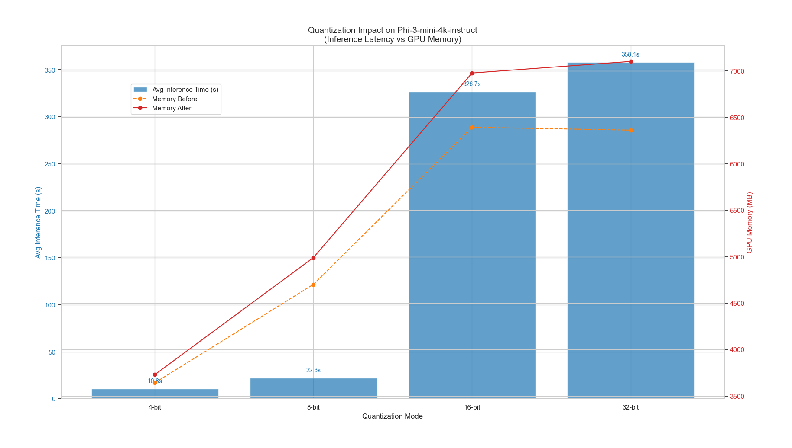

# RAG - Quantize and Run Inference on an Open-Source Model

This repository demonstrates how to load an open-source language model, quantize it for efficient inference, run local inference, and build a simple document question-answering (QA) chat pipeline using embeddings + a vector store (Chroma).

---


## Overview

- Environment and dependencies
- How to load a model (baseline script: `phi3_baseline.py`)
- How to quantize a model (8-bit/4-bit) using bitsandbytes and/or accelerate
- How to run inference locally and via the provided server (`phi3_server.py`)
- How to set up document QA/chat with a Chroma vector store
- Troubleshooting and notes about GPUs and Windows PowerShell commands
  
---


## Project Diagram



*Figure: Inference graph showing the model, tokenizer, retrieval, and QA/chat flow.*

---

## Quick Assumptions

- Python 3.10+ installed
- Git LFS enabled if downloading large model weights from Hugging Face
- For GPU inference/quantization, an NVIDIA GPU with CUDA drivers and a compatible PyTorch CUDA build is recommended

---

## Requirements

See `requirements.txt` for pinned Python dependencies. Use a virtual environment:

```powershell
python -m venv .venv
.\.venv\Scripts\Activate.ps1
python -m pip install -r requirements.txt
